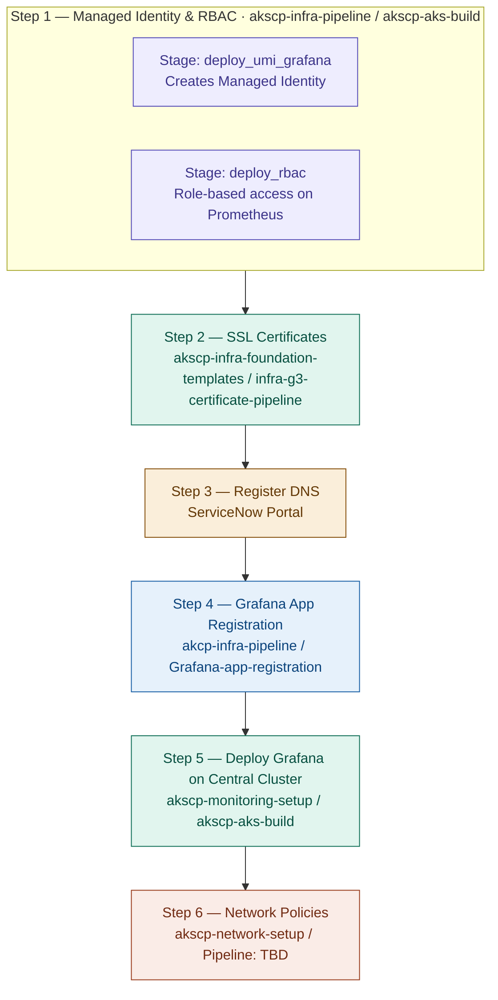

# Grafana Deployment Guide

This document outlines the end-to-end process for deploying Grafana with Azure Managed Prometheus integration.

## Deployment Flow

## Steps

### Step 1 — Managed Identity & RBAC
- **Repo:** `akscp-infra-pipeline`
- **Pipeline:** `akscp-aks-build`
- **Stages:**
  - `deploy_umi_grafana` — Creates the Managed Identity
  - `deploy_rbac` — Grants role-based access on Prometheus

### Step 2 — SSL Certificates
- **Repo:** `akscp-infra-foundation-templates`
- **Pipeline:** `infra-g3-certificate-pipeline`

### Step 3 — Register DNS
- **Portal:** ServiceNow

### Step 4 — Grafana App Registration
- **Repo:** `akcp-infra-pipeline`
- **Pipeline:** `Grafana-app-registration`

### Step 5 — Deploy Grafana on Central Cluster
- **Repo:** `akscp-monitoring-setup`
- **Pipeline:** `akscp-aks-build`

### Step 6 — Network Policies
- **Repo:** `akscp-network-setup`
- **Pipeline:** TBD
````
