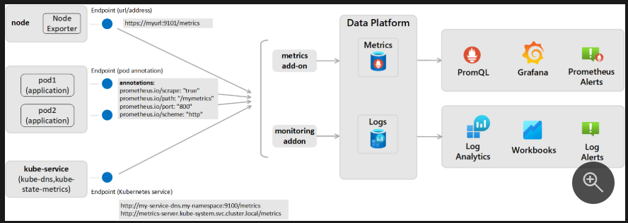

## Benefits of AKS Managed Prometheus
1. #### 🚀 Fully Managed Service
No need to install, configure, or maintain Prometheus servers.

Microsoft handles scalability, updates, storage, and availability.

2. #### 🔄 Automatic Metric Collection
Automatically scrapes Kubernetes control plane and workload metrics.

Built-in support for Kubernetes metrics, cAdvisor, Kube-state-metrics, and custom metrics.

3. #### 💡 Native Azure Integration
Integrated with Azure Monitor, Log Analytics, and Grafana.

Seamless access to metrics across Azure resources in one place.

4. #### 📈 Scalability & Retention
Handles high-scale environments without Prometheus performance tuning.

Metric retention aligned with Azure Monitor (default is 93 days).

5. #### 🔐 Security & Compliance
Metrics are secured within Azure Monitor infrastructure.

## Reference Diagram

*Overview about Prometheus scraping in Azure Monitor*

## Enabling Managed Prometheus
#### Using Bicep
Below is the sample Bicep code to enable prometheus

<span style="color: green; font-family: monospace;">kubectl get pods</span>


```
kubectl get pods
```

## Limitations & Known Issues

## References & Links

